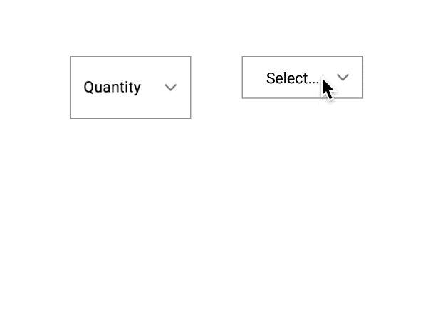

# Place Dropdown

Simple dropdown for a react-naitve application.


## Features

- iOS and Android compatible
- Self positions in the frame
- Customizable
- Can trigger with code
- Responsive


## Example



## Installation

- Via npm, `npm install place-dropdown`
- Via yarn, `yarn add place-dropdown`

## Usage

Import module

```
import Dropdown from 'place-dropdown';
```

Use a component/wrapper

```
<Dropdown
	showsPlaceholder={true}
	placeholder='Quantity'
	data={[1, 2, 3, 4, 5, 6, 7, 8]}
	onSelect={(item, index) => {
		console.log('Selected value: ' + item + ', at index: ' + index);
	}}
	.
	.
	.
/>
```

## Customization

Specify styles to customize:

- `style` - Container style
- `placeholderStyle` - Placeholder text
- `textStyle` - Row text
- `indicatorStyle` - Indicator
- `rowStyle` - Dropdown rows
- `dropdownStyle` - Dropdown container
- `modalStyle` - Modal background style

## Props

Optionally show/hide placeholder using `showsPlaceholder` prop, and indicator using `showsIndicator` prop.

------

## Contributing

Feel free to fork and send a PR. Feature suggestions welcome.

Inspired by [sohobloo/react-native-modal-dropdown](https://github.com/sohobloo/react-native-modal-dropdown).

## License

MIT.